# Jarkom-Modul-2-2026-K-25

## Anggota
| Nama | NRP | 
|---|---|
| Muhammad Yusuf | 5027251067 |
| Azhari Rahma Putri | 5027251114 |

## Laporan


11. Konfigurasikan Penny (menggunakan Apache) sebagai reverse proxy yang mengarah ke semua node di area vault (Obladi & Desmond). Sementara itu, konfigurasikan Abbey (menggunakan Nginx) sebagai reverse proxy menuju area core (Oblada & Molly). Pastikan kedua gerbang ini meneruskan identitas asli pengunjung ke server backend dengan melakukan forwarding header Host dan X-Real-IP. Buktikan bahwa Penny dan Abbey berhasil mendistribusikan lalu lintas dengan tepat.

Pada soal ini dilakukan konfigurasi reverse proxy pada dua gerbang utama jaringan:

- Penny menggunakan Apache2 sebagai reverse proxy menuju area vault yang terdiri dari node Obladi dan Desmond.
- Abbey menggunakan Nginx sebagai reverse proxy menuju area core yang terdiri dari node Oblada dan Molly.

Selain meneruskan permintaan ke backend, kedua reverse proxy juga dikonfigurasi untuk mengirimkan informasi identitas klien asli melalui header Host dan X-Real-IP agar backend dapat mengetahui asal pengunjung yang sebenarnya.

Topologi Layanan

Area Vault
| Node | IP Address |
|-|-|
| Obladi | 10.75.1.12 |
| Desmond | 10.75.1.13 |
| Penny (Proxy) | 10.75.3.10 |

Area Core
| Node | IP Address |
|-|-| 
| Oblada | 10.75.1.14 |
| Molly | 10.75.1.15 |
| Abbey (Proxy) | 10.75.2.10 |

Konfigurasi Reverse Proxy pada Penny

Penny menggunakan modul `mod_proxy`, `mod_proxy_http`, dan `mod_proxy_balancer` milik Apache untuk mendistribusikan trafik ke server backend pada area vault.

Konfigurasi Apache
```bash ProxyPreserveHost On

<Proxy "balancer://vaultcluster">
    BalancerMember http://10.75.1.12
    BalancerMember http://10.75.1.13
</Proxy>

ProxyPass "/" "balancer://vaultcluster/"
ProxyPassReverse "/" "balancer://vaultcluster/"

RequestHeader set X-Real-IP %{REMOTE_ADDR}s
```
Konfigurasi tersebut membuat Penny membagi permintaan ke dua backend yaitu Obladi dan Desmond secara bergantian.

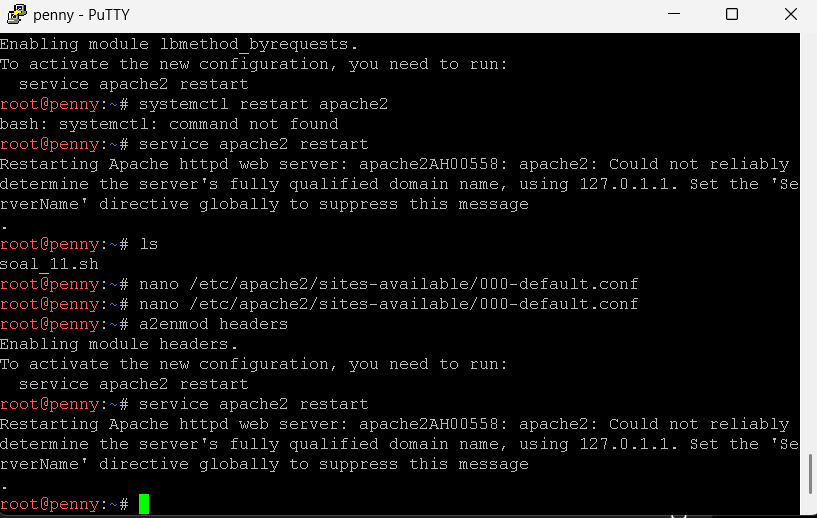


Konfigurasi Reverse Proxy pada Abbey

Abbey menggunakan fitur upstream pada Nginx untuk meneruskan trafik ke area core.

Konfigurasi Nginx
```bash 
upstream core_backend {
    server 10.75.1.14;
    server 10.75.1.15;
}

server {
    listen 80;

    location / {
        proxy_pass http://core_backend;

        proxy_set_header Host $host;
        proxy_set_header X-Real-IP $remote_addr;
    }
}
```
Konfigurasi tersebut membuat Abbey meneruskan permintaan ke Oblada dan Molly sambil tetap mengirimkan informasi host dan IP asli klien.

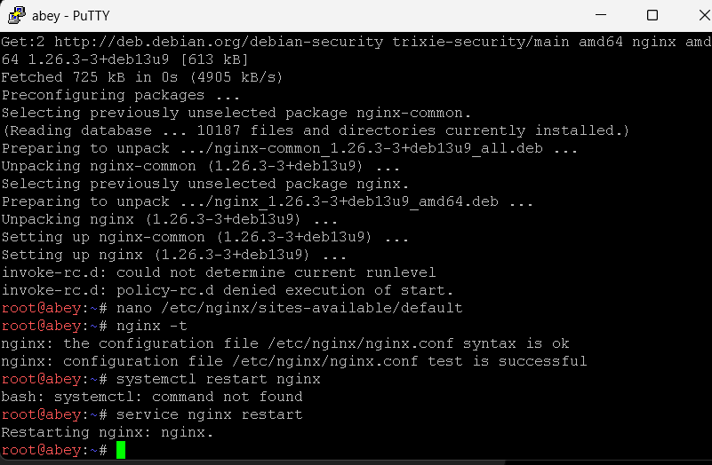


Pengujian Penny

Pengujian dilakukan dengan mengakses Penny beberapa kali menggunakan perintah:
```bash
curl http://10.75.3.10
```
Penny berhasil mendistribusikan trafik ke server obladi atau desmond secara bergantian
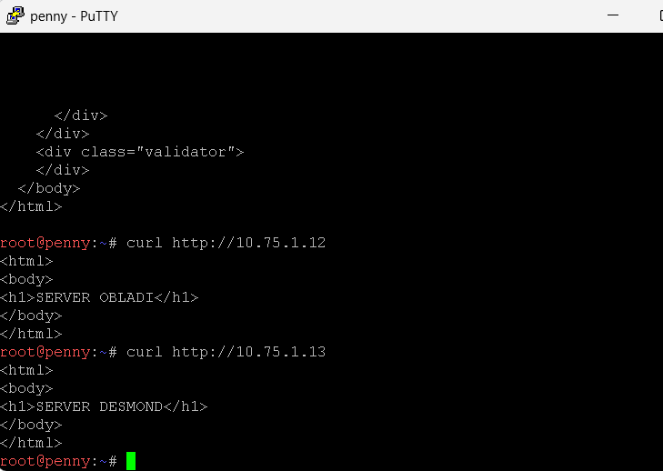

Pengujian Abbey

Pengujian dilakukan dengan perintah:
```bash
curl http://10.75.2.10
```

Abey juga berhasil mendistribusikan trafik ke server molly atau oblada secara bergantian
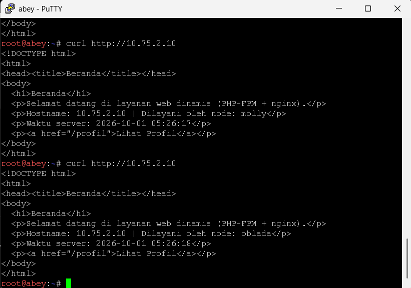

12. Terdapat ruang khusus di penny yang yang menyimpan dokumen rahasia sindikat, oleh karena itu terapkan perlindungan basic authentication untuk path /admin. Akses ke jalur tersebut harus menolak pengunjung tanpa kredensial, dan hanya mengizinkan masuk jika menggunakan credential berikut:

| username | password |
|-|-|
| prabs | pakar_pinter_jadi_gob*** |

Pada soal ini diminta untuk membuat sebuah area khusus pada server Penny yang hanya dapat diakses oleh pengguna yang memiliki kredensial yang valid. Area tersebut berada pada path `/admin` dan digunakan untuk menyimpan dokumen rahasia sindikat.

Mekanisme keamanan yang digunakan adalah HTTP Basic Authentication, sehingga setiap pengguna yang mengakses `/admin` harus memasukkan username dan password terlebih dahulu. Pengguna yang tidak memiliki kredensial yang sesuai akan ditolak aksesnya oleh server.

Konfigurasi Direktori Admin

Pertama dibuat direktori khusus untuk area admin pada Penny.
```bash
mkdir -p /var/www/html/admin
```
Kemudian dibuat halaman sederhana yang akan ditampilkan apabila proses autentikasi berhasil.
```html
<html>
<body>
    <h1>ADMIN AREA</h1>
    <p>Dokumen Rahasia Sindikat</p>
</body>
</html>
```
File tersebut disimpan sebagai:
```bash
/var/www/html/admin/index.html
```

Pembuatan File Password

Password disimpan menggunakan format hash melalui utilitas htpasswd.
```bash
htpasswd -cb /etc/apache2/.htpasswd prabs pakar_pinter_jadi_gob***
```
Hasil perintah tersebut menghasilkan file:
```bash
/etc/apache2/.htpasswd
```
yang berisi kredensial pengguna yang diperbolehkan mengakses area admin.

Konfigurasi Apache

Pada server Penny ditambahkan konfigurasi autentikasi sebagai berikut:
```bash
Alias /admin /var/www/html/admin

<Directory /var/www/html/admin>
    AuthType Basic
    AuthName "Restricted Area"
    AuthUserFile /etc/apache2/.htpasswd
    Require valid-user
</Directory>
```
Setelah konfigurasi selesai dilakukan, layanan Apache dijalankan ulang.
```bash
service apache2 restart
```

Konfigurasi penny
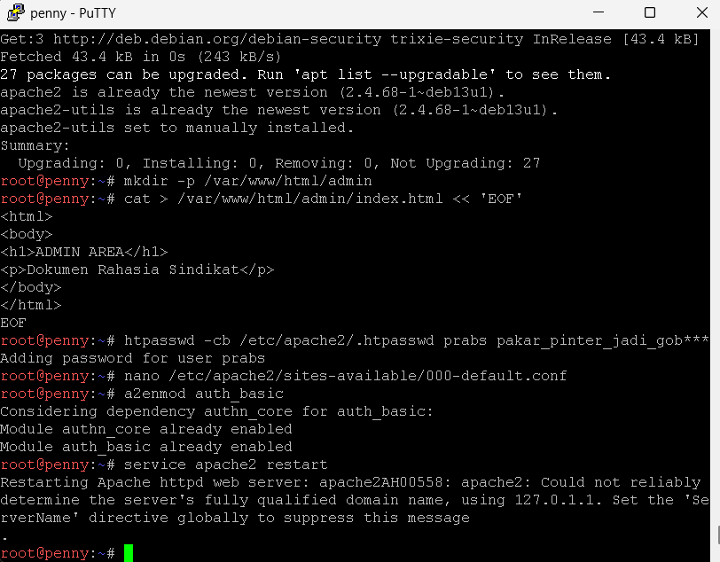

Pengujian
1. Akses Tanpa Kredensial

Pengujian dilakukan menggunakan command:
```bash
curl http://10.75.3.10/admin
```

Server akan menolak akses karena pengguna tidak memberikan username dan password.

2. Akses Dengan Kredensial Valid

Pengujian dilakukan menggunakan:
```bash
curl -u prabs:pakar_pinter_jadi_gob*** http://10.75.3.10/admin
```
Server akan berhasil mengizinkan akses karena kredensial yang diberikan sesuai dengan data yang tersimpan pada file `.htpasswd`

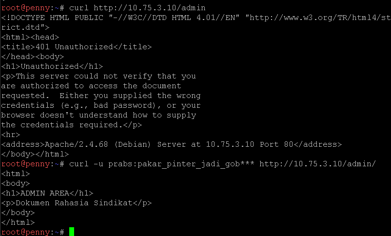

13. Setiap entitas dari luar harus memanggil gerbang dengan nama kanoniknya. Jika ada yang mencoba mengakses IP penny dan domain  penny.xxx.com, paksa sistem untuk melakukan redirect secara permanen (status code 301) menuju www.xxx.com. Sebaliknya, jika ada yang mengakses IP abbey dan domain abbey.xxx.com, lakukan redirect sementara (status code 302) menuju static.xxx.com.


Pada soal ini setiap layanan harus diakses menggunakan nama kanonik (canonical hostname) yang telah ditentukan pada DNS. Oleh karena itu dilakukan konfigurasi redirect pada kedua gerbang utama:

- Akses menuju IP Penny (10.75.3.10) atau `penny.zhari.yusuf.com` harus diarahkan secara permanen (HTTP 301) menuju `www.zhari.yusuf.com`
- Akses menuju IP Abbey (10.75.2.10) atau `abbey.zhari.yusuf.com` harus diarahkan sementara (HTTP 302) menuju `static.zhari.yusuf.com`

Konfigurasi ini bertujuan agar seluruh pengguna selalu menggunakan hostname resmi yang telah ditentukan

Konfigurasi Redirect pada Penny

Penny menggunakan Apache sebagai web server sehingga redirect dilakukan menggunakan modul mod_rewrite.

Konfigurasi Apache
```bash
<VirtualHost *:80>

    RewriteEngine On

    RewriteCond %{HTTP_HOST} ^penny\.zhari\.yusuf\.com$ [NC]
    RewriteRule ^(.*)$ http://www.zhari.yusuf.com$1 [R=301,L]

    RewriteCond %{HTTP_HOST} ^10\.75\.3\.10$
    RewriteRule ^(.*)$ http://www.zhari.yusuf.com$1 [R=301,L]

    ...
</VirtualHost>
```

Setelah konfigurasi selesai dilakukan apache perlu di restart dengan:
```bash
service apache2 restart
```

Konfigurasi Redirect pada Abbey

Abbey menggunakan Nginx sehingga redirect dilakukan melalui blok server khusus.

Konfigurasi Nginx
```bash
server {
    listen 80;

    server_name abbey.zhari.yusuf.com 10.75.2.10;

    return 302 http://static.zhari.yusuf.com$request_uri;
}
```
Setelah konfigurasi selesai dilakukan restart:
```bash
service nginx restart
```

Pengujian Penny

Pengujian dilakukan menggunakan perintah:
```bash
curl -I http://10.75.3.10
```
Hasilnya:
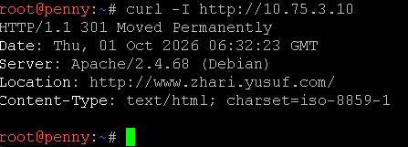

Hal ini menunjukkan bahwa akses menggunakan IP Penny berhasil dialihkan ke hostname resmi.

Pengujian Abbey

Pengujian dilakukan menggunakan:
```bash
curl -I http://abbey.zhari.yusuf.com
```
Hasilnya:

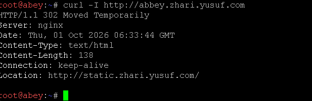

Hal ini menunjukkan bahwa Abbey berhasil melakukan redirect sementara menuju hostname static.

14. Di dalam The Mesh, rekam jejak tidak boleh dipalsukan oleh sistem. Pastikan access log pada setiap server web di area vault maupun area core mencatat alamat IP asli milik client (pengunjung) yang diteruskan oleh gerbang, dan bukan mencatat IP dari Penny ataupun Abbey.

Pada soal ini, setiap server backend di area vault dan core harus mencatat alamat IP asli dari client yang melakukan request.

Tanpa konfigurasi tambahan, backend biasanya hanya melihat IP reverse proxy, yaitu:

- Penny untuk area vault
- Abbey untuk area core

Oleh karena itu, digunakan header X-Real-IP yang sebelumnya sudah diteruskan oleh Penny dan Abbey pada soal nomor 11. Backend kemudian dikonfigurasi agar menggunakan nilai header tersebut sebagai alamat IP client pada access log.

Konfigurasi Area Vault

Area vault terdiri dari Obladi dan Desmond keduanya menggunakan Apache.

Pada masing-masing node diaktifkan modul:
```bash
a2enmod remoteip
```
Kemudian dibuat konfigurasi:
```bash
nano /etc/apache2/conf-available/realip.conf
```
dengan isi:
```bash
RemoteIPHeader X-Real-IP
RemoteIPTrustedProxy 10.75.3.10
```
Konfigurasi tersebut berarti Apache membaca alamat client dari header X-Real-IP dan IP `10.75.3.10` dipercaya sebagai reverse proxy Penny

Aktifkan konfigurasi:
```bash
a2enconf realip
```
Restart Apache:
```bash
service apache2 restart
```
Konfigurasi Area Core

Area core terdiri dari Oblada dan Molly keduanya menggunakan Nginx

Pada masing-masing node dibuat konfigurasi:
```bash
nano /etc/nginx/conf.d/realip.conf
```
dengan isi:
```bash
set_real_ip_from 10.75.2.10;
real_ip_header X-Real-IP;
real_ip_recursive on;
```

Setelah itu nginx direstart:
```bash
service nginx restart
```

Pengujian Area Vault

Pengujian dilakukan dari client Alpha dengan IP `10.75.4.10`

Request dikirim menggunakan:
```bash
curl http://vault.zhari.yusuf.com
```
Hasilnya akan:
```bash
<html>
<body>
    <h1>SERVER OBLADI</h1>
</body>
</html>
```
Kemudian access log pada Obladi diperiksa dengan:
```bash
tail -n 5 /var/log/apache2/access.log
```
Hasil yang diperoleh:
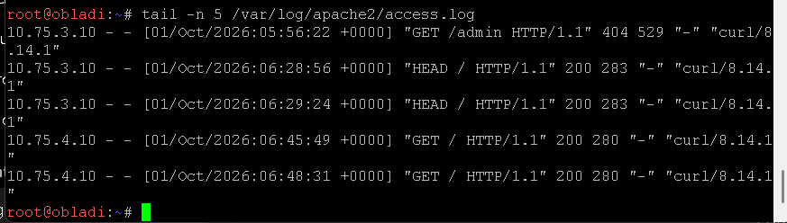
Alamat yang tercatat adalah `10.75.4.10` yang merupakan IP asli Alpha.

Sebelum konfigurasi Real IP, access log sempat mencatat `10.75.3.10`, IP tersebut merupakan alamat Penny sebagai reverse proxy.

Setelah konfigurasi `mod_remoteip`, access log berubah menjadi `10.75.4.10` yang merupakan IP asli client

Pengujian Area Core

Pengujian dilakukan dengan mengakses layanan core dari client.
```bash
curl http://core.zhari.yusuf.com
```
Kemudian log pada Oblada atau Molly diperiksa:
```bash
tail -n 5 /var/log/nginx/access.log
```
Hasil yang diharapkan adalah IP client seperti:
```bash
10.75.4.10
```
dan bukan:
```bash
10.75.2.10
```
karena `10.75.2.10` merupakan alamat Abbey sebagai reverse proxy

15. Rootkit menginstruksikan pembuatan jalur proxy khusus yang berdiri sendiri. Pada penny buat reverse proxy untuk path /eternal yang menyajikan directory /var/www/eternal, dan pastikan path ini dapat mengeksekusi (rendering) file php. Pada abbey, buat jalur /orion yang menyajikan directory /var/www/orion, secara murni statis tanpa perlu rendering php.

Pada soal ini diminta untuk membuat dua jalur layanan khusus yang berdiri sendiri dan tidak mengikuti mekanisme reverse proxy utama yang telah dibuat sebelumnya.

Konfigurasi yang harus dibuat adalah:

- Pada Penny, dibuat path `/eternal` yang mengarah ke direktori `/var/www/eternal` dan dapat mengeksekusi file PHP.
- Pada Abbey, dibuat path `/orion` yang mengarah ke direktori `/var/www/orion` dan hanya menyajikan konten statis tanpa dukungan PHP.

Dengan konfigurasi ini, kedua path dapat diakses secara independen tanpa diteruskan ke backend area vault maupun area core.

Konfigurasi Path `/eternal` pada Penny

Pembuatan Direktori

Direktori khusus dibuat pada Penny:
```bash
mkdir -p /var/www/eternal
```
Pembuatan Halaman PHP

File PHP dibuat sebagai bukti bahwa path tersebut dapat melakukan rendering PHP.
```bash
nano /var/www/eternal/index.php
```
Isi file:
```bash
<?php
echo "<h1>ETERNAL AREA</h1>";
echo "<p>PHP berhasil dijalankan</p>";
echo "<p>Waktu Server: " . date("Y-m-d H:i:s") . "</p>";
?>
```
Konfigurasi Apache

Agar path `/eternal` tidak diteruskan ke backend vault, dilakukan pengecualian pada reverse proxy.
```bash
ProxyPass /eternal !
```
Kemudian dibuat alias menuju direktori lokal.
```bash
Alias /eternal /var/www/eternal

<Directory /var/www/eternal>
    Options Indexes FollowSymLinks
    AllowOverride None
    Require all granted
</Directory>
```
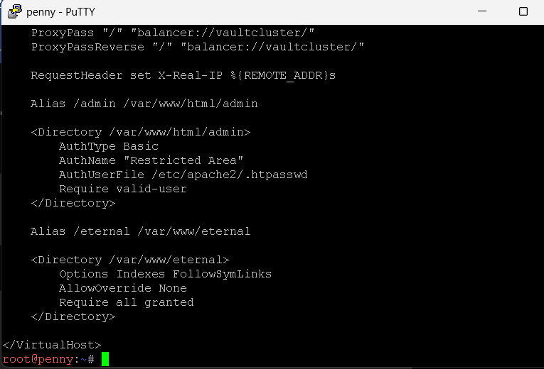

Karena pada soal sebelumnya Penny melakukan redirect ke `www.zhari.yusuf.com`, maka ditambahkan pengecualian agar `/eternal` tidak ikut terkena redirect.
```bash
RewriteCond %{REQUEST_URI} ^/eternal(/.*)?$ [NC]
RewriteRule ^ - [L]
```
Setelah konfigurasi selesai:
```bash
service apache2 restart
```
Pengujian Path `/eternal`

Pengujian dilakukan menggunakan:
```bash
curl http://10.75.3.10/eternal/
```
Hasilnya:
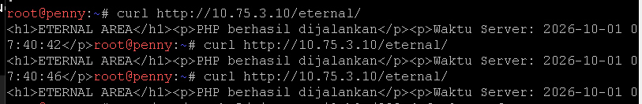

Munculnya waktu server yang berubah setiap request menunjukkan bahwa file PHP berhasil dieksekusi oleh Apache.

Konfigurasi Path `/orion` pada Abbey

Pembuatan Direktori

Direktori khusus dibuat pada Abbey:
```bash
mkdir -p /var/www/orion
```
Pembuatan Halaman Statis

File HTML dibuat sebagai konten statis.
```bash
nano /var/www/orion/index.html
```
Isi file:
```bash
<html>
<head>
    <title>ORION AREA</title>
</head>
<body>
    <h1>ORION AREA</h1>
    <p>Halaman statis pada Abbey.</p>
</body>
</html>
```
Konfigurasi Nginx

Karena Abbey sebelumnya melakukan redirect menuju static.zhari.yusuf.com, maka path /orion harus dikecualikan dari mekanisme redirect.
```bash
location /orion {
    alias /var/www/orion/;
    index index.html;
}
```
Dengan konfigurasi tersebut, seluruh request ke /orion akan langsung dilayani oleh Abbey tanpa diteruskan ke backend core.

Setelah konfigurasi selesai:
```bash
service nginx restart
```
Pengujian Path `/orion`

Pengujian dilakukan menggunakan:
```bash
curl http://abbey.zhari.yusuf.com/orion/
```
Hasilnya:
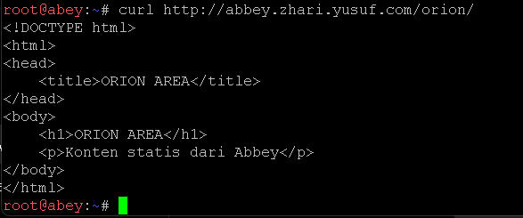

Hasil tersebut menunjukkan bahwa Abbey berhasil menyajikan konten statis dari direktori `/var/www/orion`

16. Ketahanan gerbang The Mesh harus diuji untuk menghadapi bombardir permintaan. Salah satu Klien (misal: Alpha) bertugas melakukan stress test benchmark menggunakan ApacheBench. Lakukan 250 requests dengan tingkat konkurensi (concurrencies) 10 untuk masing - masing titik akhir: www.xxx.com dan static.xxx.com. Tampilkan rangkuman hasilnya.

Untuk menguji ketahanan gerbang The Mesh, dilakukan pengujian performa menggunakan ApacheBench (ab) dari node Alpha. Pengujian dilakukan terhadap dua endpoint utama, yaitu:

- `www.zhari.yusuf.com` (Penny -> Vault Cluster)
- `static.zhari.yusuf.com` (Abbey -> Core Cluster)

Setiap pengujian menggunakan:

- Jumlah Request : 250
- Concurrency : 10
- Tools : ApacheBench (ab)

Konfigurasi Pengujian
Pengujian pada Penny (www)
```bash
ab -n 250 -c 10 http://www.zhari.yusuf.com/
```
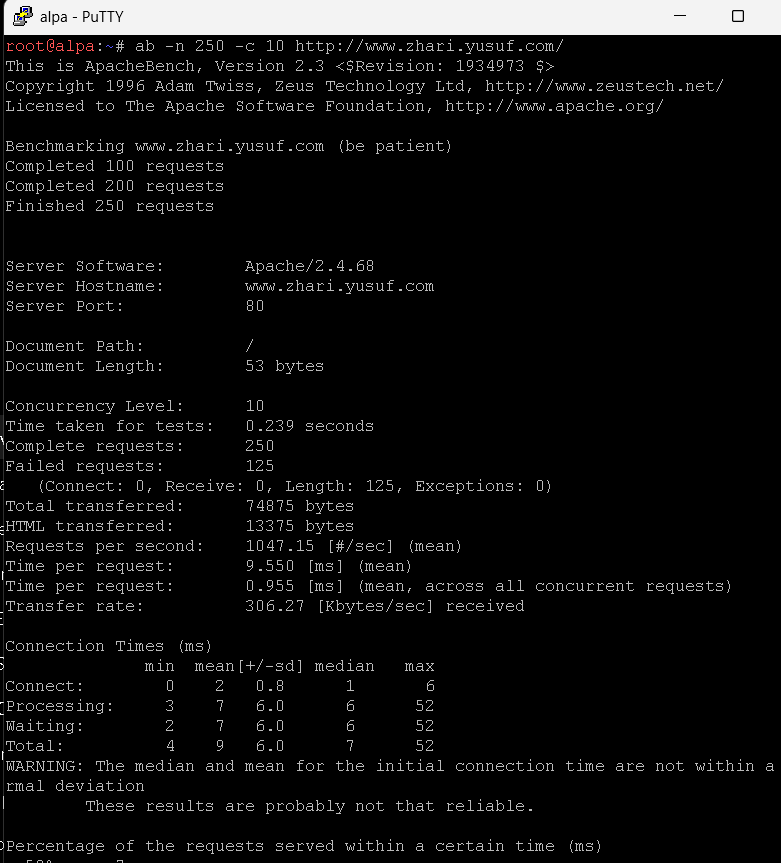

Pengujian pada Abbey (static)
```bash
ab -n 250 -c 10 http://static.zhari.yusuf.com/
```
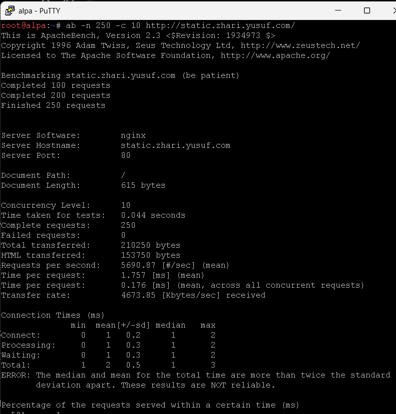

Analisis Hasil
Endpoint `www.zhari.yusuf.com` (Penny)

| Parameter | Nilai |
|-|-|
| Total Request |250 |
| Failed Request | 125 |
| Requests/sec | 1047.15 |
| Avg Response Time | 9.550 ms |

Hasil menunjukkan bahwa reverse proxy Penny mampu melayani lebih dari 1000 request per detik. Namun terdapat 125 failed requests yang disebabkan oleh perbedaan ukuran respons (response length) antara backend Obladi dan Desmond. ApacheBench menganggap respons dengan ukuran berbeda sebagai kegagalan meskipun request sebenarnya berhasil diproses oleh server.

Endpoint `static.zhari.yusuf.com` (Abbey)

| Parameter | Nilai |
|-|-|
| Total Request | 250 |
| Failed Request | 0 |
| Requests/sec | 5690.87 | 
| Avg Response Time | 1.757 ms |

Hasil menunjukkan bahwa reverse proxy Abbey mampu menangani seluruh request tanpa kegagalan. Dengan lebih dari 5600 request per detik dan rata-rata waktu respons hanya 1,757 ms, performa Abbey tergolong sangat baik untuk melayani trafik menuju server backend pada area Core.

17. Tambahkan TXT record pada DNS untuk semua klien sayap kiri dan sayap kanan (Alpha, Beta, Gamma, Delta, Epsilon). Jika DNS di-query TXT terhadap nama domain mereka (contoh: alpha.<xxxx>.com), sistem harus mengembalikan teks berupa nama hostname mereka masing-masing (contoh: "alpha").

Pada soal ini dilakukan penambahan TXT Record pada server DNS utama (Prab) untuk seluruh klien di sisi kiri dan kanan jaringan, yaitu:

- Alpa
- Beta
- Gamma
- Delta
- Epsilon

Tujuan konfigurasi ini adalah agar ketika dilakukan query DNS bertipe TXT, server DNS mengembalikan informasi berupa nama host yang bersangkutan.
Seperti contoh: 

- alpa.zhari.yusuf.com akan menghasilkan "alpa"
- beta.zhari.yusuf.com akan menghasilkan "beta"

Konfigurasi DNS

Penambahan TXT Record dilakukan pada file zona:
```bash
/etc/bind/db.zhari.yusuf.com
```
Konfigurasi yang ditambahkan:
```bash
; TXT Records Soal 17
alpa    IN TXT "alpa"
beta    IN TXT "beta"
gamma   IN TXT "gamma"
delta   IN TXT "delta"
epsilon IN TXT "epsilon"
```

Setelah konfigurasi selesai, serial number zona dinaikkan kemudian layanan DNS direstart.
```bash
service bind9 restart
```
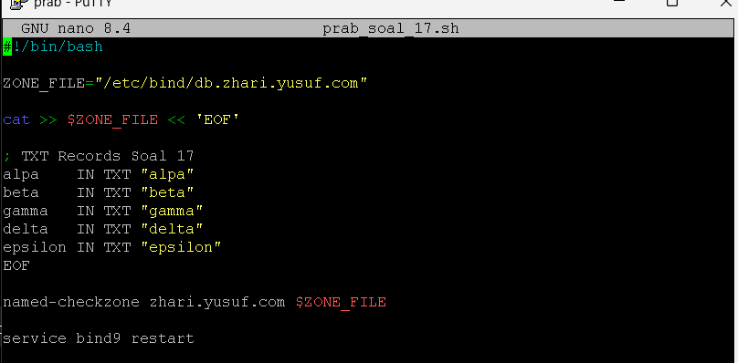

Verifikasi Konfigurasi

Pengujian TXT Record Alpa
```bash
nslookup -type=TXT alpa.zhari.yusuf.com 10.75.1.10
```
Hasilnya:
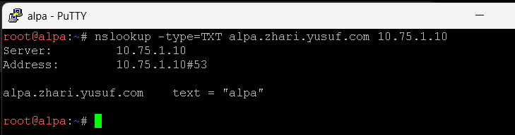

Pengujian TXT Record Beta
```bash
nslookup -type=TXT beta.zhari.yusuf.com 10.75.1.10
```
Hasilnya:

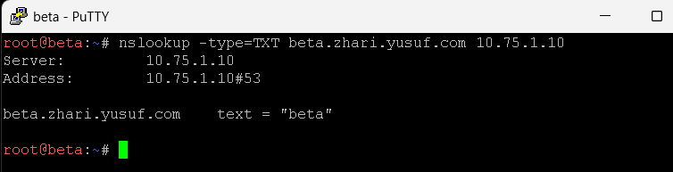

Pengujian yang sama juga berlaku untuk node yang lainnya 

18. Ubah A record DNS milik abbey.xxx.com ke alamat IP yang fiktif (ubah secara random namun pastikan format IP valid). Naikkan nilai serial SOA di prab dan pastikan tedd ikut tersinkron. Tetapkan TTL sebesar 15 detik pada record yang relevan tersebut. Verifikasi momen yang terjadi pada tiga fase pencarian: sebelum perubahan terjadi (mengembalikan IP lama), saat perubahan baru saja terjadi dalam jeda 15 detik (masih IP lama karena cache), dan setelah batas waktu TTL habis (berubah ke IP fiktif yang baru). 

Pada soal ini dilakukan perubahan A Record milik `abbey.zhari.yusuf.com` menjadi alamat IP fiktif. Setelah perubahan dilakukan, nilai SOA Serial pada DNS Master (Prab) dinaikkan agar DNS Slave (Tedd) melakukan sinkronisasi zona terbaru.

Selain itu, record abbey.zhari.yusuf.com diberikan TTL (Time To Live) sebesar 15 detik sehingga dapat diamati perilaku cache DNS pada tiga kondisi:

- Sebelum perubahan (IP lama)
- Sesaat setelah perubahan (cache masih menyimpan IP lama)
- Setelah TTL habis (IP berubah ke IP baru)

Konfigurasi pada DNS Master (Prab)

File zona yang digunakan:
```bash
/etc/bind/db.zhari.yusuf.com
```
Sebelum Perubahan IP abbey `10.75.2.10`
```bash
abbey IN A 10.75.2.10
```
IP Abbey diubah menjadi alamat fiktif:
```bash
abbey IN 15 A 192.168.123.123
```
Nilai SOA Serial juga dinaikkan:
```bash
2026100108 ; Serial
```
Setelah konfigurasi selesai dilakukan reload DNS:
```bash
service bind9 restart
```

Sinkronisasi DNS Slave (Tedd)

Awalnya DNS Slave masih menyimpan data lama:
```bash
dig @127.0.0.1 abbey.zhari.yusuf.com
```
Hasil:
```bash
abbey.zhari.yusuf.com. 604800 IN A 10.75.2.10
```
Karena zona belum tersinkronisasi ulang, dilakukan transfer ulang zona:
```bash
rndc retransfer zhari.yusuf.com
service bind9 restart
```

Pengujian Tiga Fase TTL

Fase 1 Sebelum Perubahan

Sebelum record diubah, query DNS mengembalikan alamat asli Abbey.
```bash
nslookup abbey.zhari.yusuf.com 10.75.1.10
```
Hasilnya:
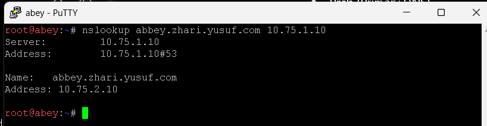

Fase 2 Setelah Perubahan Tetapi Masih Dalam Masa Cache

Setelah record diubah dan serial dinaikkan, klien yang masih memiliki cache lama tetap memperoleh alamat sebelumnya.

bisa menggunakan dig atau named-compilezone
```bash
dig abbey.zhari.yusuf.com
```
```bash
named-compilezone -f raw -F text \
```
Hasilnya:
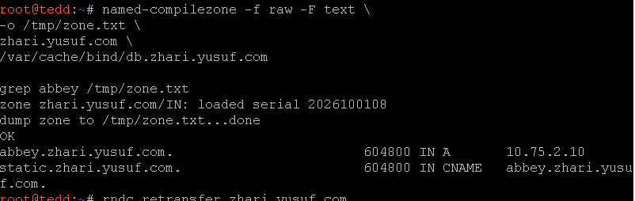

Hal ini terjadi karena resolver masih menyimpan jawaban lama di dalam cache dan TTL belum habis.

Fase 3 Setelah TTL 15 Detik Berakhir

Setelah menunggu lebih dari 15 detik, resolver melakukan query ulang ke DNS server dan memperoleh data terbaru.
```bash
dig abbey.zhari.yusuf.com
```
atau
```bash
named-compilezone -f raw -F text \
```
Hasilnya:
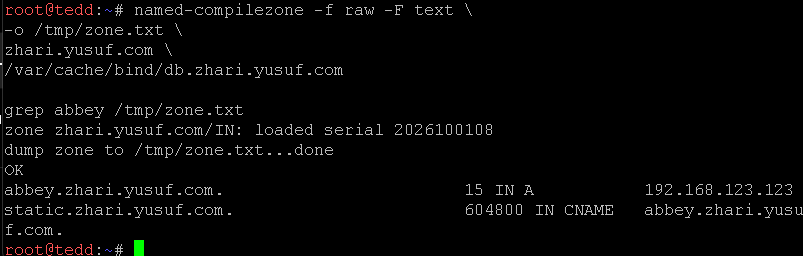

Hasil ini menunjukkan bahwa cache lama telah kadaluarsa dan resolver menerima record baru dari DNS server.

19. Last? But not least? Buat CNAME record yang melakukan binding dari domain internal outbound.xxx.com menuju domain eksternal http.badssl.com, Lakukan perintah curl ke http://outbound.xxx.com dan pastikan output yang dihasilkan sesuai dengan isi konten di halaman http.badssl.com.

Pada tugas ini dibuat sebuah CNAME Record yang menghubungkan domain internal:
```bash
outbound.zhari.yusuf.com
```
ke domain eksternal:
```bash
http.badssl.com
```
Tujuan konfigurasi ini adalah agar ketika klien melakukan query DNS terhadap outbound.zhari.yusuf.com, DNS akan mengembalikan alias menuju http.badssl.com.

Selanjutnya dilakukan pengujian menggunakan perintah curl untuk memastikan domain internal tersebut mengarah ke layanan yang sama dengan domain eksternal tujuan.

Konfigurasi DNS

Konfigurasi dilakukan pada file zona DNS di server Prab.

edit file:
```bash
/etc/bind/db.zhari.yusuf.com
```
Tambahkan record berikut:
```bash
outbound IN CNAME http.badssl.com.
```
Setelah konfigurasi ditambahkan, serial SOA dinaikkan kemudian service DNS direstart.
```bash
service bind9 restart
```
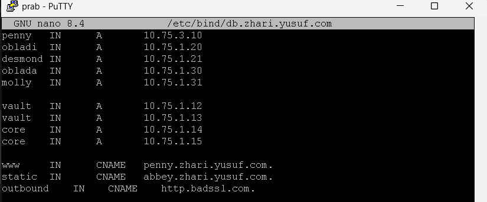

Verifikasi DNS

Query CNAME

Pengujian dilakukan dari node Alpha.
```bash
nslookup outbound.zhari.yusuf.com 10.75.1.10
```
Hasilnya:
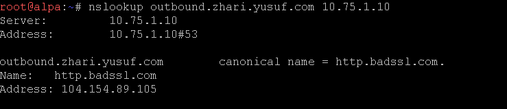

Hasil tersebut menunjukkan bahwa DNS berhasil mengembalikan alias menuju domain eksternal http.badssl.com.

Pengujian HTTP

Akses Domain Tujuan
```bash
curl http://http.badssl.com
```
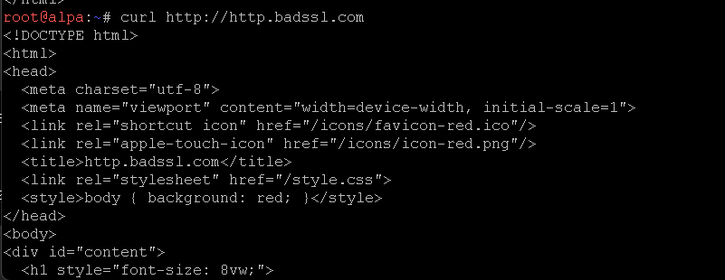

Berdasarkan hasil pengujian DNS:

`utbound.zhari.yusuf.com` menuju ke `http.badssl.com`

CNAME telah berhasil dikonfigurasi dan proses resolusi DNS berjalan dengan benar.

Namun, hasil curl terhadap kedua domain menghasilkan konten yang berbeda. Hal ini terjadi karena CNAME hanya memengaruhi proses resolusi nama domain (DNS) dan tidak bertindak sebagai reverse proxy ataupun content forwarding.

Saat klien melakukan:
```bash
curl http://outbound.zhari.yusuf.com
```
HTTP request tetap menggunakan header:
```bash
Host: outbound.zhari.yusuf.com
```
sedangkan server `http.badssl.com` mengharapkan:
```bash
Host: http.badssl.com
```
Akibatnya server tujuan menampilkan halaman default yang berbeda dari konten utama `http.badssl.com`

Kesimpulannya adalah DNS berhasil mengarahkan hostname internal ke alamat IP milik `http.badssl.com`, konten HTTP tidak otomatis menjadi identik hanya karena menggunakan CNAME lalu untuk menghasilkan konten yang sama  maka diperlukan reverse proxy yang mengubah Host Header

20. Setelah semua penyelesaian selesai, pastikan semua service dan konfigurasi yang telah dikerjakan dari awal tetap berjalan normal dan berstatus autostart saat node di-restart (khusus untuk kasus ini, abaikan konfigurasi nomor 18 dan biarkan koordinat kembali normal).

Service apache masih tetap berjalan berjalan 

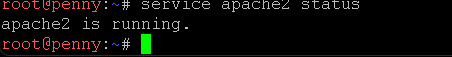

Service nginx masih tetap berjalan berjalan 

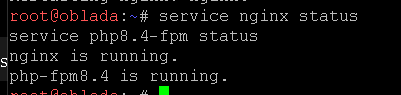

Service bind9 masih tetap berjalan berjalan 

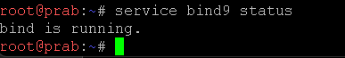

Agar konfigurasi otomatis berjalan ketika node direstart, kita menggunakan master script di setiap node, mengonfigurasikannya di settingan setiap node  
